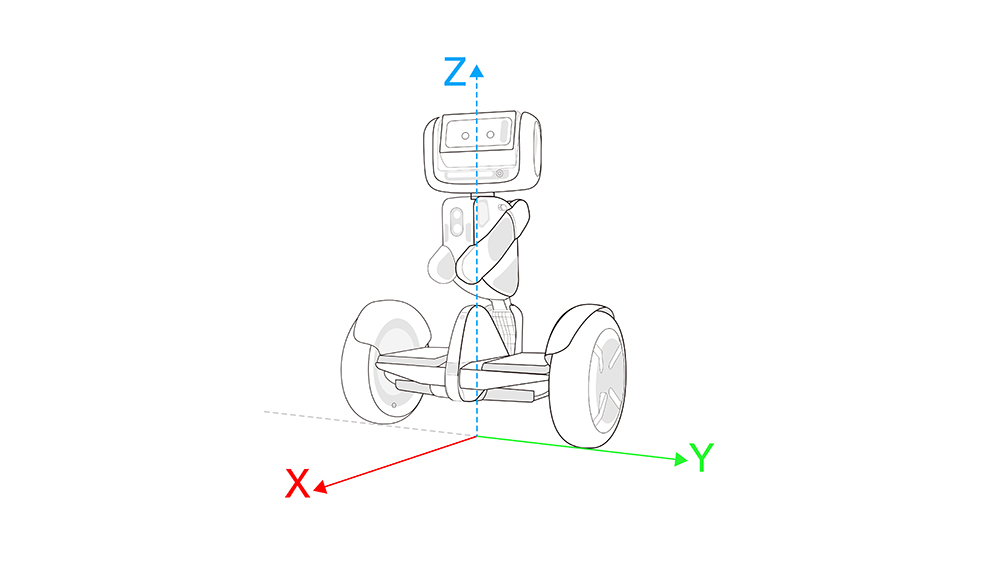
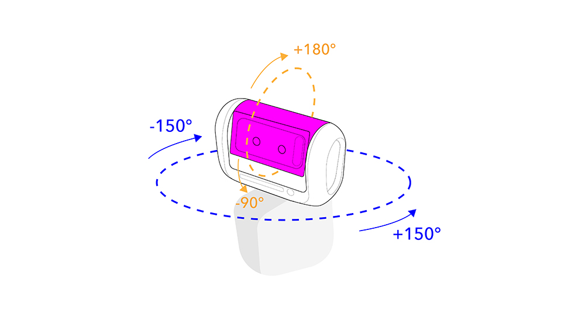

# loomo-on-azure
A quick integration test for the Segway Loomo

## Background Informatio

- [Developer Docs](https://developer.segwayrobotics.com/developer/documents/segway-robots-sdk.html)
- [Loomo Samples](https://github.com/SegwayRoboticsSamples/)
- [Azure's IoT Client SDK for Android Devices](https://github.com/Azure/azure-iot-sdk-java/blob/master/doc/java-devbox-setup.md#building-for-android-device)
- [Android Docs](https://developer.android.com/training/basics/firstapp/)
- [Java Language Tutorials](https://docs.oracle.com/javase/tutorial/java/TOC.html)

## Loomo's Coordinate System





## Connecting to Azure

Be sure to edit the ```MainActivity.java``` file and set the ```connString``` near the top.

## Telemetry

Loomo sends the following telemetry data to the cloud

```json
{
  "Base":{
    "OdometryPose":{
      "AngularVelocity":-0.029381856,
      "LinearVelocity":0.18418857,
      "Theta":0.038606558,
      "X":0.28975758,
      "Y":0.07275029
    },
    "AngularVelocity":-0.029381856,
    "AngularVelocityLimit":0.0,
    "CartMile":56,
    "ControlMode":0,
    "LightBrightness":87,
    "LinearVelocity":0.5277778,
    "LinearVelocityLimit":5.0,
    "Mileage":379147.0,
    "RidingSpeedLimit":5.0,
    "RobotPower":72,
    "UltrasonicDistance":285.0,
    "UltrasonicObstacleAvoidanceDistance":1.2,
    "BodyLightOpen":0,
    "CartModeWheelSlip":1,
    "InCartMode":0,
    "RidingInSpeedLimit":0,
    "UltrasonicObstacleAvoidanceEnabled":0
  },
  "Head":{
    "HeadJointPitch":-1.5783722,
    "HeadJointRoll":0.0,
    "HeadJointYaw":1.5721389,
    "HeadMode":4,
    "HeadPitchAngularVelocity":0.0,
    "HeadRollAngularVelocity":0.0,
    "HeadWorldPitch":-1.4297315,
    "HeadWorldRoll":-1.3991402,
    "HeadWorldYaw":0.0,
    "HeadYawAngularVelocity":0.0
  },
  "Sensor":{
    "BasePose":{
      "Yaw":0.6345122,
      "Pitch":-0.4716176,
      "Roll":-0.003835069
    },
    "BaseTicks":{
      "LeftTicks":6927,
      "RightTicks":7143
    },
    "BaseWheelInfo":{
      "LeftSpeed":1865,
      "RightSpeed":1793
    },
    "HeadJointYaw":1.5721389,
    "HeadJointPitch":-1.5783722,
    "HeadJointRoll":0.0,
    "HeadWorldYaw":0.0,
    "HeadWorldPitch":-1.4297315,
    "HeadWorldRoll":-1.3991402,
    "InfraredData":{
      "LeftDistance":431.0,
      "RightDistance":428.0
    },
    "Pose2D":{
      "AngularVelocity":0.0121628875,
      "LinearVelocity":0.19247325,
      "Theta":0.05790984,
      "X":0.3030938,
      "Y":0.07339437
    },
    "UltrasonicDistance":285.0
  },
  "EventProcessedUtcTime":"2019-08-14T04:29:25.3199855Z",
  "PartitionId":1,
  "EventEnqueuedUtcTime":"2019-08-14T04:29:25.2590000Z",
  "IoTHub":{
    "MessageId":"97235897-cc25-461b-9d62-a9f5ba493ac7",
    "CorrelationId":"91c2ee16-e023-49ba-869f-a434d65d65b1",
    "ConnectionDeviceId":"robot",
    "ConnectionDeviceGenerationId":"637008302286304863",
    "EnqueuedTime":"2019-08-14T04:29:25.2630000Z",
    "StreamId":null
}
```

For IoT Central properties need to be top-level (not nested). Fortunately, unknown properties are ignored, so if you want this robot to talk to IoT Central, you'll need to promote the properties that you would like access to. A meaningful sample in node can be found [here](https://docs.microsoft.com/en-us/azure/iot-central/howto-connect-nodejs#add-a-real-device). Don't forget these instructions to create a [connection string](https://docs.microsoft.com/en-us/azure/iot-central/tutorial-add-device#generate-the-connection-string).

## Cloud to Device messages

Loomo can respond to messages from the cloud in the following form

```json
{
  "type": "move", 
  "linear": 0, 
  "angular": 1
}

{
  "type": "look",
  "yaw": 1.5,
  "pitch": 0.7
}

{
  "type": "socket",
  "address": "192.168.0.100",
  "port": 9000,
  "cadence": 1000
}
```

## Current Issues

See [issues](https://github.com/seank-com/loomo-on-azure/issues)

## Explanation of Segway APIs by package

### Base

