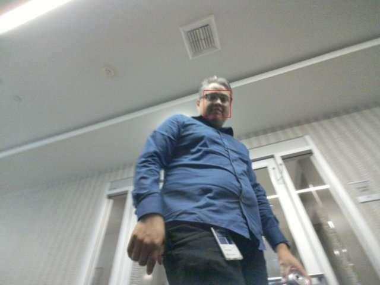
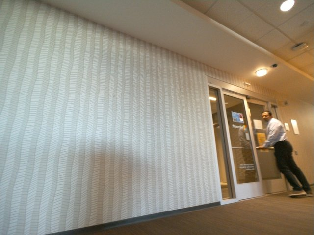
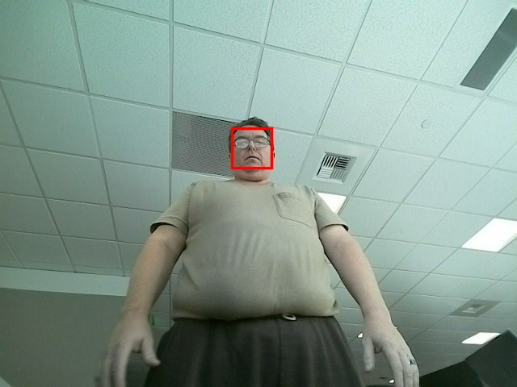
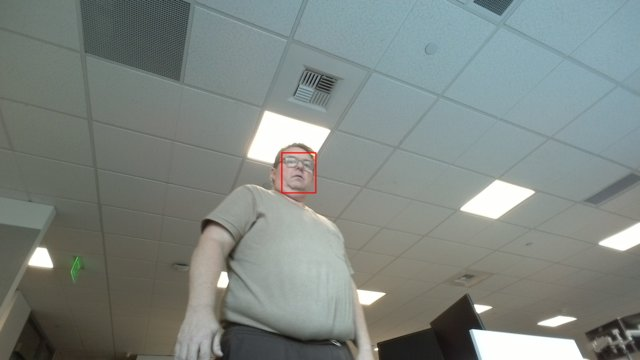

## Summary

We conducted several tests of the Loomo camera hardware to try and capture images of people suitable for face recognition. In the end, we found the hardware insufficient in exposure range, capture speed, and resolution.

## Day 1

On Day 1, images were recorded at maximum resolution (3264x2448), most images captured were too blurry for the model to detect any faces. The few faces that were detected, the model indicated were like too blurry for identification.


There were a few images where faces could be detected

```json
  "faceRectangle": {
    "top": 534,
    "left": 1528,
    "width": 175,
    "height": 175
  },
  "blur": {
    "blurLevel": "high",
    "value": 0.9
  },
```


```json
  "faceRectangle": {
    "top": 653,
    "left": 1530,
    "width": 168,
    "height": 168
  },
  "blur": {
    "blurLevel": "high",
    "value": 0.85
  },
```


```json
  "faceRectangle": {
    "top": 801,
    "left": 1479,
    "width": 189,
    "height": 189
  },
  "blur": {
    "blurLevel": "high",
    "value": 1
  },
```


```json
  "faceRectangle": {
    "top": 801,
    "left": 1479,
    "width": 189,
    "height": 189
  },
  "blur": {
    "blurLevel": "high",
    "value": 1
  },
```


```json
  "faceRectangle": {
    "top": 832,
    "left": 1517,
    "width": 141,
    "height": 141
  },
  "blur": {
    "blurLevel": "high",
    "value": 0.98
  },
```



```json
  "faceRectangle": {
    "top": 778,
    "left": 1751,
    "width": 230,
    "height": 230
  },
  "blur": {
    "blurLevel": "high",
    "value": 0.96
  },
```

## Day 2 & 3

After the first day we hypothesized that the movement of the head due to DTS tracking might be contributing to the blur and also the particular spot was not an area conducive to slow moving people. So we made changes to the code to stop head motion while taking pictures and planned to position Loomo in a better location near the kitchen where people generally congregate or slowed to grab a drink. Again images were recorded at maximum resolution (3264x2448), again many were blurry, however this time about half of the images where faces were detected the blurLevel was medium. OBservationally, this appears to be the set of people that stopped and interacted with Loomo.


Slightlyly more faces were detected.


```json
  "faceRectangle": {
    "top": 1035,
    "left": 1813,
    "width": 166,
    "height": 166
  },
  "blur": {
    "blurLevel": "medium",
    "value": 0.62
  },
```


```json
  "faceRectangle": {
    "top": 1423,
    "left": 1404,
    "width": 52,
    "height": 52
  },
  "blur": {
    "blurLevel": "medium",
    "value": 0.46
  },
```


```json
  "faceRectangle": {
    "top": 1238,
    "left": 2178,
    "width": 152,
    "height": 152
  },
  "blur": {
    "blurLevel": "medium",
    "value": 0.68
  },
```


```json
  "faceRectangle": {
    "top": 1316,
    "left": 1832,
    "width": 263,
    "height": 263
  },
  "blur": {
    "blurLevel": "medium",
    "value": 0.7
  },
```


```json
  "faceRectangle": {
    "top": 1704,
    "left": 845,
    "width": 120,
    "height": 120
  },
  "blur": {
    "blurLevel": "high",
    "value": 0.92
  },
```


```json
  "faceRectangle": {
    "top": 1587,
    "left": 1679,
    "width": 120,
    "height": 120
  },
  "blur": {
    "blurLevel": "high",
    "value": 0.94
  },
```


```json
  "faceRectangle": {
    "top": 614,
    "left": 1652,
    "width": 176,
    "height": 176
  },
  "blur": {
    "blurLevel": "medium",
    "value": 0.44
  },
```


```json
  "faceRectangle": {
    "top": 948,
    "left": 1553,
    "width": 209,
    "height": 209
  },
  "blur": {
    "blurLevel": "high",
    "value": 0.78
  },
```


```json
  "faceRectangle": {
    "top": 1230,
    "left": 1509,
    "width": 141,
    "height": 141
  },
  "blur": {
    "blurLevel": "high",
    "value": 0.8
  },
```

## Day 4

Troubleshooting with the Loomo engineers, they indicated that the camera functioned better in more light. So we attached a 215 lumen worklight to the head of the Loomo to direct more light where the camera was looking.


Again, images were recorded at maximum resolution (3264x2448).




Images were faces were detected were again less blurry, particularly those where there seemed to be interaction with Loomo


```json
  "faceRectangle": {
    "top": 957,
    "left": 1584,
    "width": 212,
    "height": 212
  },
  "blur": {
    "blurLevel": "low",
    "value": 0.22
  },
```


```json
  "faceRectangle": {
    "top": 701,
    "left": 1908,
    "width": 234,
    "height": 234
  },
  "blur": {
    "blurLevel": "high",
    "value": 0.77
  },
```


```json
  "faceRectangle": {
    "top": 886,
    "left": 887,
    "width": 239,
    "height": 239
  },
  "blur": {
    "blurLevel": "medium",
    "value": 0.54
  },
```


```json
  "faceRectangle": {
    "top": 781,
    "left": 1641,
    "width": 221,
    "height": 221
  },
  "blur": {
    "blurLevel": "medium",
    "value": 0.28
  },
```

## Day 5

After looking at the result from Day 4, we determined that we needed to identify the maximum resolution where Loomo could snap clear photos of people while they walked by. We place Loomo is a very high light environment and adjusted the resolution of recorded photos.

### Experiment-1

Images were recorded at a resolution of 640x480


Detected faces were very sharp, but again only occured when I stopped versus when I was walking past.



```json
  "faceRectangle": {
    "top": 159,
    "left": 287,
    "width": 49,
    "height": 49
  },
  "blur": {
    "blurLevel": "low",
    "value": 0
  },
```


```json
  "faceRectangle": {
    "top": 83,
    "left": 308,
    "width": 48,
    "height": 48
  },
  "blur": {
    "blurLevel": "low",
    "value": 0.2
  },
```

### Experiment-2

We hypothesized that cognitive services was not detecting faces because they were too small, so we tried increasing the resolution. This time, images were recorded at a resolution of 1920x1080


This time more faces were recognized, but more were medium blurry.



```json
  "faceRectangle": {
    "top": 458,
    "left": 845,
    "width": 102,
    "height": 102
  },
  "blur": {
    "blurLevel": "medium",
    "value": 0.41
  },
```


```json
  "faceRectangle": {
    "top": 152,
    "left": 848,
    "width": 103,
    "height": 103
  },
  "blur": {
    "blurLevel": "medium",
    "value": 0.5
  },
```


```json
  "faceRectangle": {
    "top": 599,
    "left": 939,
    "width": 109,
    "height": 109
  },
  "blur": {
    "blurLevel": "low",
    "value": 0.16
  },
```


```json
  "faceRectangle": {
    "top": 512,
    "left": 1164,
    "width": 82,
    "height": 82
  },
  "blur": {
    "blurLevel": "medium",
    "value": 0.43
  },
```


```json
  "faceRectangle": {
    "top": 6,
    "left": 574,
    "width": 162,
    "height": 162
  },
  "blur": {
    "blurLevel": "low",
    "value": 0
  },
```

## Hardware

The front facing camera on the Loomo is capable of the following resolutions

```
3264x2448
3264x1836
2560x1920
2560x1440
2048x1536
1600x1200
1920x1080
1280x720
1024x768
720x480
640x480
320x240
```

## Environment

The [National Optical Astronomy Observatory](https://www.noao.edu/) provide a [recommended light levels](https://www.noao.edu/education/QLTkit/ACTIVITY_Documents/Safety/LightLevels_outdoor+indoor.pdf) resource for instructors. Pertinent to our example is this section of one of the tables.

| Activity | Illumination (lux) |
|-|-|
| Working areas where visual tasks are only occasionally performed | 100-150 |
| Warehouses, Homes, Theaters, Archives | 150 |
| Easy Office Work, Classes | 250 |

We tested the Loomo in three locations, 2 well trafficked hallways (103 lux & 214 lux) and by a west facing window in the afternoon sun (2157 lux). So these are not non-standard low light conditions.


## Cognitive Services requirements

According to the [documentation](https://docs.microsoft.com/en-us/azure/cognitive-services/face/concepts/face-detection), faces need to be 36x36 to 4096x4096 do be detected. Additionaly, for [recognition](https://westus.dev.cognitive.microsoft.com/docs/services/563879b61984550e40cbbe8d/operations/563879b61984550f30395239) faces should be 200x200 or bigger.

## Conclusions

Given the above for a scenario where Loomo captures faces of occupants and recognizes them, we believe the captures would look something like this.


Where the rectangle of the face is 52x52. To get a face of atleast 200x200, the overall resolution would need to be 12554x9416 or 118 Megapixel more than double the current maximum. Not only this but the camera would need to be able to capture at faster shutter speeds in light as low as 100 lux. This seems impractical but there are a few things we can recommend from our learning. 

- The DTS ```PlannerPersonTracking``` was far more accurate with the addition of the 215 lumen LED lamp, we recommend adding a builtin lamp for Loomo to use.
- A higher quality camera with faster response will greatly improve the results.
- Cognitive Services is not ready for this type of scenario and a different model should be used.
- Alternately, a whole different approach might be to have Loomo scan for employee badges when people are detected and snap pictures when people without badges are spotted.

**NOTE:** *All images were post processed to reduce size and add faces rectangles using one of the following imagemagick commands.*

```bash
convert source.jpg -resize 640x640 dest.png
convert source.jpg -fill none -stroke red -strokewidth 3 -draw "rectangle <left>,<top>,<left+width>,<top+height>" -resize 320x320 dest.jpg
```

